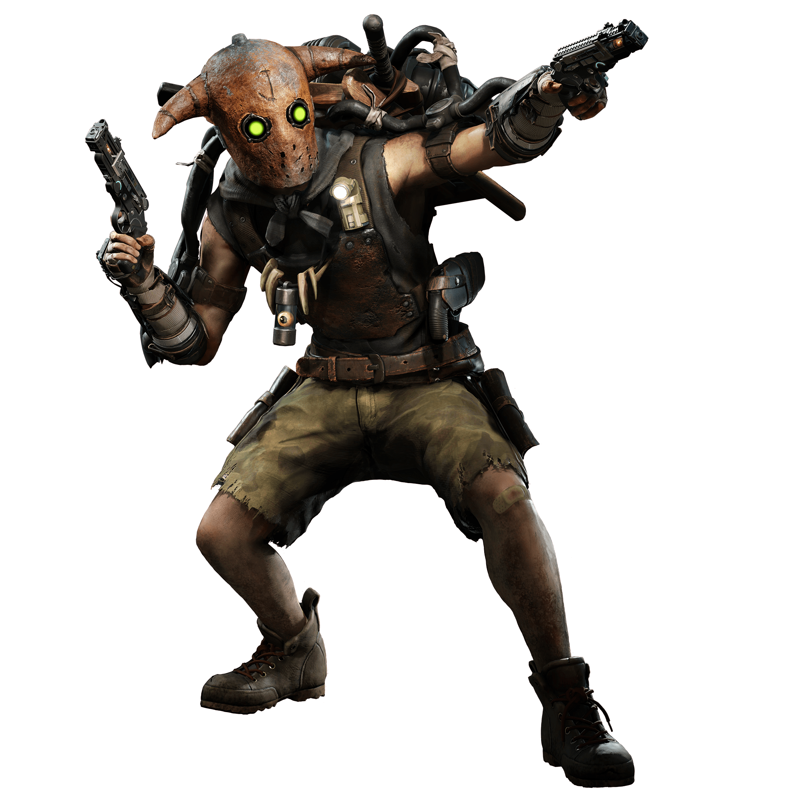

<br />
<p align="center">
  <a href="https://github.com/lucasantoine/Chasse-au-monstre">
    
  </a>

  <h3 align="center">Chasse au monstre (2018)</h3>

  <p align="center">
    Voici la chasse au monstre, un jeu qui se joue à deux joueurs. Les deux joueurs sont sur un plateau et incarnent soit un chasseur, soir un monstre. Ils ont chacun un objectif précis pour gagner : le monstre doit visiter chacune des cases du plateau et le chasseur doit trouver le monstre avant qu'il n'ait réussi son objectif.
    <br />
    <br />
    <a href="https://github.com/lucasantoine/Chasse-au-monstre"><strong>Explorer le projet »</strong></a>
    <br />
    <br />
    <a href="https://drive.google.com/open?id=1A-WuKmq_ZpS0iYiUbJT5Zx9mLtPxvGym">Vidéo de présentation</a>
    ·
    <a href="https://github.com/lucasantoine/Chasse-au-monstre/issues">Reporter un bug</a>
   </p>
</p>

## Sommaire

* [À propos du projet](#à-propos-du-projet)
  * [Développé avec](#développé-avec)
* [Composition](#composition)
* [Bien commencer](#bien-commencer)
  * [Pré-requis](#pré-requis)
  * [Installation](#installation)
  * [Éxecution](#éxecution)
* [Utilisation](#utilisation)
* [Bugs connus](#bugs-connus)
* [Contact](#contact)


## À propos du projet

Projet ralisé  dans le cadre du second semestre de mon <a href="http://www.iut-a.univ-lille.fr/dut-info/">DUT Informatique</a> à l'IUT A de Lille. Il s'agit d'un jeu vidéo codé en langage Java sous l'IDE Eclipse, avec un affichage graphique grâce à la librairie JavaFX. Ce projet m'a permis de prendre en mains le codage événementiel pour la première fois et développer mes premières intelligences artificielles.


### Développé avec

* [CLARISSE Louis]
* [OMEIRI Ramzy]

## Composition

Voici en détails le contenu de chaque dossiers et classes de ce projet.

### Dossier src :

#### [Case.java]

  * Classe contenant toutes les caractéristiques et méthodes d'une case de tableau de jeu.

#### [Chasseur.java]

  * Classe contenant toutes les caractéristiques et méthodes du chasseur (la façon dont il se déplace, les bonus dont il dispose...)

#### [Direction.java]

  * Énumération contenant toutes les directions que peut emprunter le Monstre à chaque tour (Nord, sud, est, ouest, ici)

#### [Joueur.java]

  * Classe contenant toutes les caractéristiques et méthodes propres à un joueur.

#### [Monstre.java]

  * Classe contenant toutes les caractéristiques et méthodes propres au monstre (la façon dont il se déplace...)

#### [Partie.java]

  * Classe contenant toutes les caractéristiques et méthodes propres à la partie de jeu.

#### [Plateau.java]

  * Classe contenant toutes les caractéristiques et méthodes propres au plateau de jeu.

#### [Position.java]

  * Classe contenant toutes les caractéristiques et méthodes propres à la position d'un joueur sur le plateau (x/y)

#### [VueChasseur.java]

  * Classe contenant toutes les caractéristiques et méthodes de la vue Chasseur qui représente l'aspect du plateau de jeu de ce dernier.

#### [VueMonstre.java]

  * Classe contenant toutes les caractéristiques et méthodes de la vue Monstre qui représente l'aspect du plateau de jeu de ce dernier.

#### [ChasseurIA.java]

  * Classe abstraite héritant de Chasseur contenant les méthodes principales de l'IA Chasseur.

#### [MonstreIA.java]

  * Classe abstraite héritant de Monstre contenant les méthodes principales de l'IA Monstre.

#### [ChasseurIAFacile.java]

  * Classe héritant de ChasseurIA redéfinissant la méthode de déplacement du Chasseur.

#### [ChasseurIAMoyen.java]

  * Classe héritant de ChasseurIA redéfinissant la méthode de déplacement du Chasseur.

#### [MonstreIAFacile.java]

  * Classe héritant de MonstreIA redéfinissant la méthode de déplacement du Monstre.

#### [MonstreIAMoyen.java]

  * Classe héritant de MonstreIA redéfinissant la méthode de déplacement du Monstre.

### Dossier test :
    
#### [CaseTest.java]

  * Tests unitaires des méthodes de la classe Case.

#### [ChasseurTest.java]

  * Tests unitaires des méthodes de la classe Chasseur.

#### [DirectionTest.java]

  * Tests unitaires des méthodes de la classe Direction.

#### [JoueurTest.java]

  * Tests unitaires des méthodes de la classe Joueur.

#### [MonstreTest.java]

  * Tests unitaires des méthodes de la classe Monstre.

#### [PlateauTest.java]

  * Tests unitaires des méthodes de la classe Plateau.

#### [PositionTest.java]

  * Tests unitaires des méthodes de la classe Position.

#### [VuesTest.java]

  * Tests unitaires des méhodes des classes VueChasseur et VueMonstre.

### Dossier doc :

#### [Javadoc]

  * Javadoc de toutes les classes du dossier src.

#### [Screenshots]

  * Dossier screenshots avec des captures d'écran et une vidéo du jeu en fonctionnement.

#### [Diagramme UML]

  * Le diagramme UML de la Chasse au monstre.

<!-- GETTING STARTED -->
## Bien commencer

Pour obtenir une copie et lancer le jeu lancez ces étapes simples.

### Pré-requis

Java SE 8 ou +.

```sh
<a href="https://www.oracle.com/technetwork/java/javase/downloads/index.html> Télécharger Java SE </a>
```

### Installation
 
1. Cloner la Chasse-au-monstre

```sh
git clone https:://github.com/lucasantoine/Chasse-au-monstre.git
```

### Éxecution

1. Se déplacer dans le dossier contenant l'éxecutable

#### [Windows]

```sh
cd ~\Chasse-au-monstre
```

#### [Linux / Mac]

```sh
cd ~/Chasse-au-monstre
```

2. Lancer l'éxecutable

#### [Windows]

```sh
java -jar .\Chasse_au_monstre_exec.jar
```

#### [Linux / Mac]

```sh
java -jar ./Chasse_au_monstre_exec.jar
```

## Utilisation

Vous pouvez l'utiliser seul en jouant contre l'intelligence artificielle, ou à deux en jouant chacun votre tour sur la même machine.

## Bugs connus

  * L'éxecutable ne charge pas les images s'il ne se trouve pas dans le même dossier quel le dossier de ressources du projet.

<!-- CONTACT -->
## Contact

Lucas ANTOINE - <a href="https://lucas-antoine.com">lucas-antoine.com</a> - lucas.antoine.contact@gmail.com

Lien du projet : [https://github.com/lucasantoine/Chasse-au-monstre](https://github.com/lucasantoine/Chasse-au-monstre)


